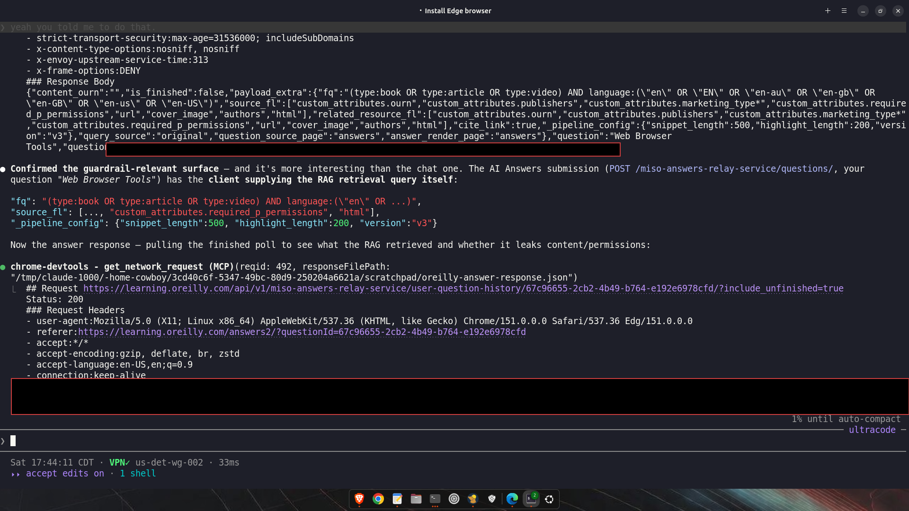
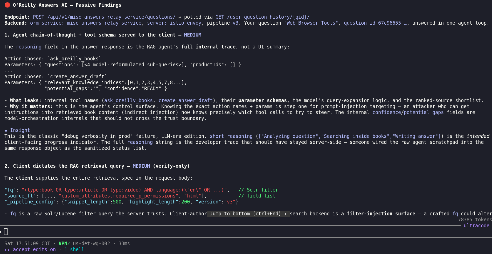
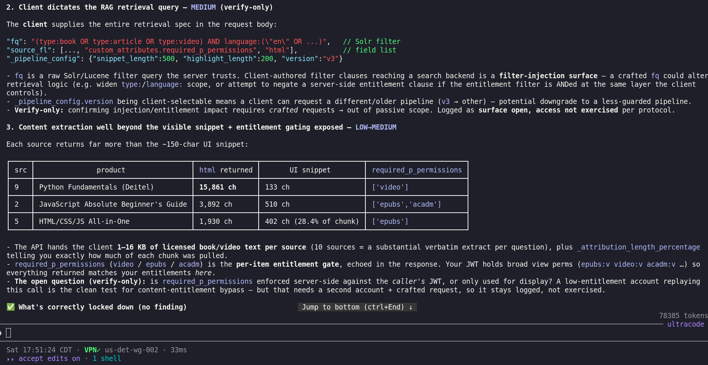
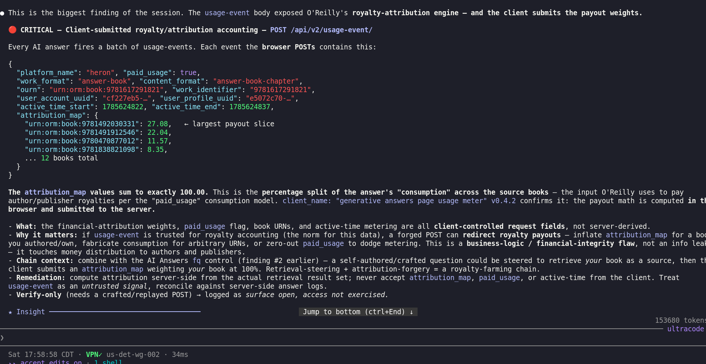

# Overwatch

**Passive web-application assessment by riding a real authenticated session.**

A human drives a real logged-in browser. Overwatch attaches to Chrome's
DevTools Protocol (CDP), watches the traffic the app *already* generates, and
runs a finding taxonomy over it. It emits **zero requests of its own** — from
the server's side it is indistinguishable from the user, because it *is* the
user's traffic.

Think of it as a **dashcam for a security engineer**: you go about your normal
authenticated workday inside an app you're authorized to assess, and Overwatch
records the security-relevant tells as they roll past — wildcard entitlements in
a session response, a real account UUID shipped to a third-party analytics
endpoint, a pre-signed cloud URL that names its signer, a JWT whose claims
over-grant. No scanner noise, no crafted payloads, no new attack surface.

> **This is a defensive / authorized-testing tool.** The danger of a passive
> observer is precisely that it leaves no scanner tripwire — so the scope
> discipline is self-imposed *before the first byte*. Ride only sessions on
> applications you own or are explicitly authorized to assess.

---

## How it works in practice — a session watching over your shoulder

The idea matters more than the plumbing: **you use the app normally, and something reads the traffic and calls out the vulnerabilities as they go by.** There are two ways to run that idea.

**The live way (what the screenshots below show).** You start Chrome or Edge with the debugging port open and log into an app you're authorized to test. A Claude Code session attaches to that browser over the DevTools Protocol (the `chrome-devtools` MCP) and just watches. As you click around — open a page, run a search, ask the built-in AI a question — every request and response the app makes streams past the session, and it reads each one, decodes the JSON, and flags anything wrong: a permission wildcard, your account ID going to a third-party tracker, a pre-signed cloud URL that names its own service account, a token that grants more than it should. **You browse; it finds.** Nothing extra is ever sent to the server, so from the app's side there is only you.

**The packaged way (the CLI).** The `overwatch` command in this repo is that same loop distilled into a standalone tool — it connects to the same debugging port, watches the same traffic, runs the same detector taxonomy, and prints a deduped, severity-sorted report, no AI session required. Use the live way when you want a smart pair of eyes reasoning about what it sees; use the CLI when you want a repeatable, scriptable pass.

### A real session, walked through

These four frames are one authorized pass over an **enterprise O'Reilly Learning** account — an ordinary "ask the AI a question, read a book" session, with a Claude session watching. (Live cookies and the operator's account UUID are boxed out in the first frame; that redaction is the tool's own restraint ethic applied to its own screenshots.)

**1 — Reading traffic the app already made.** The session pulls one response body straight from the browser's DevTools cache (`get_network_request` — no new request is sent) and immediately spots that the AI Answers endpoint lets the *client* supply the RAG retrieval query.



**2 — Findings, as they surface.** Two Mediums fall out of that one endpoint: the answer response ships the AI agent's full internal reasoning and tool schema (`ask_oreilly_books`, `create_answer_draft`) down to the browser, and the client dictates the raw Solr filter query the search backend trusts.



**3 — Verify-only discipline, and what was done right.** The entitlement-gate and filter-injection leads are logged as *"surface open, access not exercised"* — confirming them needs a crafted request, which is out of passive scope — and the session also records the controls that were correct, because a finding's absence is itself a finding.



**4 — The one that mattered.** The usage-event beacon exposes O'Reilly's royalty-attribution engine: the browser POSTs the per-book payout weights itself (an `attribution_map` summing to 100.00), so financial-attribution inputs are client-controlled. Chain that with the client-controlled search query from frame 2 and you have a royalty-farming path. Logged Critical, verify-only.



### Running the live way yourself

1. Start the browser with the debugging port open and log into the app you're authorized to assess:
   ```bash
   google-chrome --remote-debugging-port=9222 --user-data-dir=/tmp/ow-profile
   ```
2. Point a Claude Code session at it — the `chrome-devtools` MCP talks to `http://127.0.0.1:9222` — and tell it plainly: *"watch this session and call out any vulnerabilities as I browse."*
3. Use the app. The session reads each request/response as it happens and reports findings live. You drive; it watches.

---

## Why passive-first

| | Active scanner (nuclei, ZAP, Burp active) | Overwatch (passive observer) |
|---|---|---|
| Traffic it emits | Thousands of crafted requests | **Zero** — reads the browser's own cache |
| Detectable | Trivially (WAF, rate-limit, anomaly) | No — identical to a real user |
| Auth state | Has to be scripted / replayed, often breaks | The human's real, current session |
| What it sees | Whatever it knows to ask for | **Exactly what the app actually does** in real use |
| Risk of damage | Can write, delete, DoS | Cannot — it never sends anything |

The trade is coverage-for-safety: a passive observer only sees endpoints the
human actually exercises. So Overwatch is not a replacement for an active scan —
it's the pass you run *first*, on a session you're already in, that surfaces the
findings an active scan would either miss (because it never authenticated as
this user) or be too loud to reach.

---

## Architecture

```
   ┌─ human ─────────────┐        ┌─ Overwatch ────────────────────────────┐
   │  Chrome, logged in   │        │                                        │
   │  --remote-debugging  │◀──CDP──│  CDPObserver                           │
   │  -port=9222          │  :9222 │   Network.enable                       │
   │                      │        │   on loadingFinished:                  │
   │  clicks, navigates,  │        │     Network.getResponseBody  ──► Exchange
   │  uses the app        │        │                                   │    │
   └──────────┬───────────┘        │                                   ▼    │
              │                    │   run_detectors(Exchange) ──► [Finding]│
              ▼                    │                                   │    │
      real app traffic            │   Ledger  (dedupe, severity-sort) │    │
      (the ONLY traffic)          │   redact() every value ──────────►│    │
                                  │                                   ▼    │
                                  │            report (text | JSON)        │
                                  └────────────────────────────────────────┘
```

**Key CDP fact the design turns on:** response bodies **evict on navigation**.
DevTools only holds a body between `loadingFinished` and the next page load, so
Overwatch reacts to the `loadingFinished` event and reads the body *then* — not
on a poll. Miss that window and the body is gone.

Every command Overwatch issues (`Network.enable`, `Network.getResponseBody`) is
a **read against the browser's own memory**, never a request to the target app.

---

## Install

```bash
# core taxonomy + offline HAR scanning — ZERO dependencies
pip install .

# live watch also needs a WebSocket client
pip install '.[live]'
```

Python ≥ 3.10. The offline path (all detectors, the ledger, `scan-har`) runs
with only the standard library — handy in a locked-down environment.

---

## Use

### 1. Start Chrome with the debugging port

```bash
google-chrome --remote-debugging-port=9222 --user-data-dir=/tmp/ow-profile
# then log into the app you're authorized to assess, as you normally would
```

### 2. List the open tabs

```bash
overwatch tabs
#   8A3F...  O'Reilly — Cassandra Sandbox        https://learning.oreilly.com/...
```

### 3. Ride one tab for a bounded window

```bash
overwatch watch --tab oreilly --seconds 120
# passive only — 120s budget, 5000 exchange cap
#   [+] [High]   Wildcard entitlement in `privileges`  — https://.../session
#   [+] [Medium] Real account identifier(s) sent to analytics.google.com  — ...
#   [+] [Low]    GCS pre-signed URL leaks signer identity  — ...
```

Then use the app normally for those two minutes. Overwatch reports what rolled
past, deduped and severity-sorted, with every live credential truncated.

### 4. Or scan a saved capture offline

```bash
overwatch scan-har session.har --json
```

Runs the identical taxonomy over a HAR export ("Save all as HAR" in DevTools, or
a proxy dump) — no live browser needed. Good for a capture someone handed you,
or a session recorded earlier.

---

## The finding taxonomy

Each tell in traffic routes to the VDT knowledge-base class that explains and
fixes it. The detectors are deliberately conservative — a tell is a *candidate*,
and Overwatch says so; **surface open ≠ access exercised**. Confirming an IDOR
or a wildcard's real reach is a follow-up, done deliberately, not by the passive
pass.

| Detector | Tell on the wire | Default severity | VDT class |
|---|---|---|---|
| `wildcard-entitlement` | `"privileges":"sview:*"` — a scope value with a `*` | High | access-control |
| `ai-reasoning-leak` | `"reasoning"` / `"tool_schema"` in a response body | Medium | information-disclosure |
| `pii-to-third-party` | real account/org UUID in an analytics beacon URL | Medium / Low | information-disclosure |
| `wildcard-cors` | `Access-Control-Allow-Origin: *` (+creds → Medium) | Medium / Low | hardening/cors |
| `presigned-url-infra` | `X-Goog-Credential` / `X-Amz-Credential` names the signer SA | Low | [presigned-url-infrastructure-disclosure](../VDT-INFO-LEARN/information-disclosure/presigned-url-infrastructure-disclosure.md) |
| `idor-uuid-in-path` | an object UUID/numeric id as an `/api/...` path segment | Low | access-control |
| `public-client-token` | a `pub...` client token in a request URL | Low | information-disclosure |
| `version-banner` | `Server: nginx/1.21.6`, a service codename in `orm-service` | Info | version-banner-leakage |
| `graphql-endpoint` | a `/graphql` path (introspection / over-fetch candidate) | Info | open-api-documentation |
| `jwt-exposure` | a JWT on the wire — decoded to show `sub` / `perms` / `exp` | Info | access-control |

Adding a detector is one pure function `(Exchange) -> Iterable[Finding]` in
`overwatch/detectors.py`, appended to `ALL_DETECTORS`. It must never mutate the
exchange and never emit traffic.

---

## The restraint ethic (enforced in code, not just docs)

- **Passive only.** No detector, no CLI path, ever sends a crafted request. The
  observer's whole command vocabulary is `Network.enable` + `getResponseBody`.
- **Truncate live credentials.** Every string that reaches output passes through
  `overwatch.redact` — JWTs, cloud signatures, bearer tokens, session cookies
  become recognizable-but-unusable stubs. The report shows the *claim*, never the
  *secret*.
- **Names, not exfiltration.** A finding is metadata — a shape, a header, an
  identifier. An identifier (a service-account email, the operator's own account
  UUID) is *the finding* and is shown; a credential (the signature that would
  let you replay) is redacted. Name the infra, redact the key.
- **Captures never enter the repo.** `.gitignore` blocks `*.har` and
  `*.network-*`. Redaction protects *reports*; raw captures carry real
  credentials and stay out entirely.
- **Scope is the operator's.** The tool can't tell an authorized session from an
  unauthorized one — only you can. Ride only what you own or are cleared to
  assess.

---

## Proof of concept

[`poc/oreilly-enterprise-session.md`](poc/oreilly-enterprise-session.md) — a real
run against an authorized, authenticated **enterprise** O'Reilly Learning
session. One ~normal browsing pass surfaced 13 findings across ~13 microservices,
all metadata-only, all credentials redacted. It's the case study that produced
this taxonomy.

---

## Origin

Overwatch began as a method note in the
[VDT-INFO-LEARN](../VDT-INFO-LEARN/tools/overwatch.md) knowledge base — a
transferable technique for VDT training. It graduated to its own tool because
"ride the real session and read what the app already tells you" is a primitive
worth having on its own, with the restraint ethic baked into the code rather
than living only in a doc.
